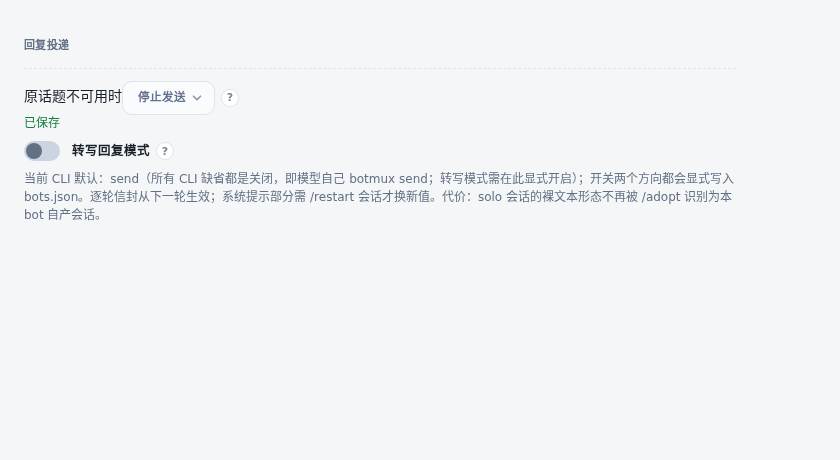

# 原话题不可用时的发送策略

`topicUnavailablePolicy` 是每个机器人的可选配置。默认 `legacy` 沿用原有发送和引用失效后的回退规则；`stop` 在受保护的写入尝试前核验原话题，已撤回或状态无法确认时拒绝写入，查询失败可重试。未配置的机器人继续使用 `legacy`。

Dashboard 的“回复投递”区域可选择“原话题不可用时”的策略，也可通过既有 botconfig 字段编辑入口设置或清空它。保存走统一配置存储，成功后立即回读生效值；失败保留原选择。配置不改变最终回复使用 send 或 transcript 的方式，不重启会话。

底层覆盖公共 Lark 消息写入、原生 CoT、CLI send/report 的原消息与原执行来源。daemon relay、派发初始化、Worker 和 workflow 的来源传递在各调用方接入，需与对应后续变更一起验证。已撤回消息的查询与远端写入不是原子事务。API-only 门禁和清理既有表情/置顶的行为保持。

图片为真实页面组件的离线渲染，保存接口使用 fixture，不涉及运行中的机器人。
